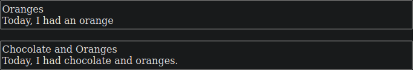

# FoxListMaker
An HTML cataloguing system

```diff
- Removes all files with the extension 'html' and 'source' from the current working directory when ran!
```
At the moment, it's about 60 minutes old and is nowhere near ready for use. However, it does take a 5-column source file with the following:

  Title,Pageref,imageref,tags,content
  
And produces HTML files according to the tags laid out in the "source.txt" index.

Work will continue!

The Sample source file has 3 entries:

    Apples,001,001.png,apples+fruit+food,"Today, I have been eating apples"
    Oranges,002,002.png,oranges+fruit+food,"Today, I had an orange"
    Chocolate and Oranges,003,003.png,oranges+chocolate,"Today, I had chocolate and oranges."
    
Running go.py produces the following for 'oranges.html':


And this for 'chocolate.html':

